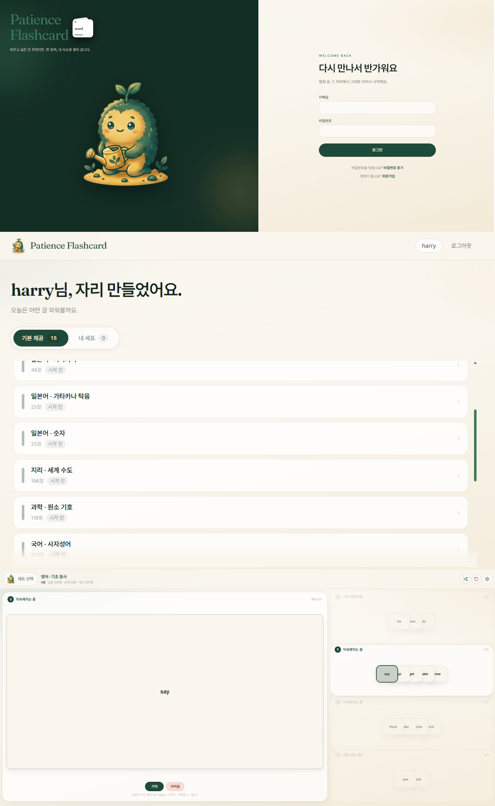

#  Patience Flashcard

## 💻 Developer

<div align="center">

| <a href="https://github.com/Hyeonseok93" target="_blank"></a> |
| :------------------------------------------------------------------------------------------------------------------------------------: |
|                                                [김현석](https://github.com/Hyeonseok93)                                                |

</div>

---

> [!NOTE]
> 이미 있던 **페이션스(다층) 플래시카드 암기 방식**을 웹으로 옮긴 학습 앱입니다. 기본 제공 세트와 내 세트(xlsx)를 같은 플레이 규칙으로 돌리고, 진행도는 사용자마다 따로 저장합니다.

## 🚀 Overview

아버지께서 자격증 시험 준비 중 암기를 도와드릴 웹 서비스를 만들어 달라고 하셔서 시작된 프로젝트입니다. 제가 만든 것은 **이 암기 방식을 웹 서비스로 구현한 코드**이고, **페이션스형 플래시카드라는 학습 컨셉 자체를 고안한 것은 아닙니다.**

한 장씩 넘기는 암기가 아니라, **여러 층(레벨)에 카드를 나눠 두고** “기억 / 까먹음 / 다음”으로 올려·내리는 **페이션스형 학습 보드**를 브라우저에서 쓰게 한 것입니다. **Patience**는 로그인 후 공용 시드 덱과 개인 덱을 고르고, 같은 엔진으로 이어서 학습할 수 있게 했습니다.

React에서 세트 목록·편집·플레이 UI를 제공하고, Spring Boot가 **인증(이메일 OTP)·덱/카드·진행도·xlsx import/export** 를 담당합니다. PostgreSQL에 덱·카드·`study_progress`를 두고, 로컬은 Docker Compose로 FE · BE · DB · 메일 UI까지 한 번에 올립니다.

**가입(메일 인증) → 세트 선택 → 다층 플레이 → (내 세트) 편집·엑셀 교체** 흐름 위에 JWT(HttpOnly 쿠키) 인증, Flyway 시드, Nginx 정적 서빙·`/api` 프록시를 붙여 둔 학습 서비스입니다.

---

## 🛠 Built With

<div align="center">

<picture>
  <source media="(prefers-color-scheme: dark)" srcset=".github/readme/badges/dark/typescript.png">
  <source media="(prefers-color-scheme: light)" srcset=".github/readme/badges/light/typescript.png">
  
</picture>
<picture>
  <source media="(prefers-color-scheme: dark)" srcset=".github/readme/badges/dark/react.png">
  <source media="(prefers-color-scheme: light)" srcset=".github/readme/badges/light/react.png">
  
</picture>
<picture>
  <source media="(prefers-color-scheme: dark)" srcset=".github/readme/badges/dark/vite.png">
  <source media="(prefers-color-scheme: light)" srcset=".github/readme/badges/light/vite.png">
  
</picture>
<picture>
  <source media="(prefers-color-scheme: dark)" srcset=".github/readme/badges/dark/reactrouter.png">
  <source media="(prefers-color-scheme: light)" srcset=".github/readme/badges/light/reactrouter.png">
  
</picture>
<picture>
  <source media="(prefers-color-scheme: dark)" srcset=".github/readme/badges/dark/tailwindcss.png">
  <source media="(prefers-color-scheme: light)" srcset=".github/readme/badges/light/tailwindcss.png">
  
</picture>
<br />
<picture>
  <source media="(prefers-color-scheme: dark)" srcset=".github/readme/badges/dark/java.png">
  <source media="(prefers-color-scheme: light)" srcset=".github/readme/badges/light/java.png">
  
</picture>
<picture>
  <source media="(prefers-color-scheme: dark)" srcset=".github/readme/badges/dark/springboot.png">
  <source media="(prefers-color-scheme: light)" srcset=".github/readme/badges/light/springboot.png">
  
</picture>
<picture>
  <source media="(prefers-color-scheme: dark)" srcset=".github/readme/badges/dark/springsecurity.png">
  <source media="(prefers-color-scheme: light)" srcset=".github/readme/badges/light/springsecurity.png">
  
</picture>
<picture>
  <source media="(prefers-color-scheme: dark)" srcset=".github/readme/badges/dark/jwt.png">
  <source media="(prefers-color-scheme: light)" srcset=".github/readme/badges/light/jwt.png">
  
</picture>
<picture>
  <source media="(prefers-color-scheme: dark)" srcset=".github/readme/badges/dark/hibernate.png">
  <source media="(prefers-color-scheme: light)" srcset=".github/readme/badges/light/hibernate.png">
  
</picture>
<br />
<picture>
  <source media="(prefers-color-scheme: dark)" srcset=".github/readme/badges/dark/postgresql.png">
  <source media="(prefers-color-scheme: light)" srcset=".github/readme/badges/light/postgresql.png">
  
</picture>
<picture>
  <source media="(prefers-color-scheme: dark)" srcset=".github/readme/badges/dark/flyway.png">
  <source media="(prefers-color-scheme: light)" srcset=".github/readme/badges/light/flyway.png">
  
</picture>
<picture>
  <source media="(prefers-color-scheme: dark)" srcset=".github/readme/badges/dark/gradle.png">
  <source media="(prefers-color-scheme: light)" srcset=".github/readme/badges/light/gradle.png">
  
</picture>
<picture>
  <source media="(prefers-color-scheme: dark)" srcset=".github/readme/badges/dark/docker.png">
  <source media="(prefers-color-scheme: light)" srcset=".github/readme/badges/light/docker.png">
  
</picture>
<picture>
  <source media="(prefers-color-scheme: dark)" srcset=".github/readme/badges/dark/nginx.png">
  <source media="(prefers-color-scheme: light)" srcset=".github/readme/badges/light/nginx.png">
  
</picture>
<picture>
  <source media="(prefers-color-scheme: dark)" srcset=".github/readme/badges/dark/vitest.png">
  <source media="(prefers-color-scheme: light)" srcset=".github/readme/badges/light/vitest.png">
  
</picture>

</div>

<details>
<summary><b>기술 스택 상세 보기</b></summary>
<br>

<div align="center">

| 구분 | 기술 | 역할 |
| --- | --- | --- |
| **Frontend Core** | TypeScript, React 19, Vite 6 | SPA 렌더링·개발 서버·프로덕션 번들 |
| **Routing & UI** | React Router DOM 7, Tailwind CSS 4 | 페이지 라우팅, 유틸리티 퍼스트 스타일 |
| **Backend Core** | Java 21, Spring Boot 3.5, Web, Data JPA, Validation, Actuator | REST API, 헬스체크 |
| **Auth & Security** | Spring Security, JWT (HttpOnly 쿠키), 메일 OTP, DB rate limit | 가입·로그인·비밀번호 재설정, enumeration 완화 |
| **Persistence** | PostgreSQL 15, Hibernate / JPA, Flyway | 유저·덱·카드·진행도, 빌트인 시드 |
| **Import / Export** | Apache POI (xlsx) | 내 세트 가져오기·내보내기·엑셀 교체 |
| **Build & Test** | Gradle, Vitest | 백엔드 빌드, 프론트 단위 테스트 |
| **Edge & Local** | Nginx, Docker Compose, Mailpit | 정적 서빙·`/api` 프록시, 로컬 인증 메일 UI(`/mail`) |

</div>

</details>

---

## 🖥️ Preview · 자세히 보기

<p align="center">
  
</p>

<div align="center">

| 화면 | 설명 |
| --- | --- |
| 🔐 가입 · 로그인 | 이메일 OTP 인증 후 가입, JWT HttpOnly 쿠키 세션 |
| 📚 세트 선택 | **기본 제공** / **내 세트** 탭, 이어하기·랜덤·순서 시작 |
| 🃏 플레이 | 다층 보드, 기억·까먹음·다음, 단축키, 클리어·승리 화면 |
| ✏️ 내 세트 편집 | 이름 변경, 카드 CRUD, xlsx 교체 |
| 🚫 접근 거부 | 타인 세트 등 403에 전용 마스코트 게이트 |

</div>

---

## 🌟 Key Implementation

1. **다층(레벨) 페이션스형 학습 엔진 (기존 암기 방식의 웹 구현)**  
   이미 쓰이던 페이션스 플래시카드 규칙을 웹에 옮긴 것입니다. 카드를 층에 쌓아 두고, 기억하면 위로·까먹으면 아래로 보냅니다.  
   * 프론트 `engine` / `actions`가 이 규칙의 구현 출처이고, 진행은 카드 **id** 기준으로 서버에 저장합니다.  
   * 층 수(2~4)를 시작 시 고르고, 클리어 횟수는 덱별 배지로 남깁니다.

2. **BUILTIN / USER 덱 분리와 소유권 검사**  
   시드 덱은 모두가 읽고 플레이만 하고, 내 세트만 수정·엑셀·삭제가 됩니다.  
   * `requireAccessible` — 공용 또는 본인 덱만 조회·진행·복사.  
   * `requireOwnedUserDeck` — 수정 계열은 USER+본인만(BUILTIN은 403, 타인 덱은 404).

3. **진행도 JSON + 클리어 이력 보존**  
   `study_progress`에 levels/queue JSON과 `completed_count` / `clear_count`를 둡니다.  
   * 활성 진행이 있을 때만 목록에 “이어하기”가 보입니다.  
   * 카드 편집·리셋은 플레이 상태만 비우고 `clear_count`는 남길 수 있습니다.  
   * 클리어 stub(`exists=false`)여도 완료 스냅샷이면 새로고침 시 승리 화면을 복원합니다.

4. **메일 OTP 가입 · 비밀번호 재설정 (enumeration 완화)**  
   가입 전 메일 인증, 재설정도 동일 OTP 검증 경로를 씁니다.  
   * 이메일 가용성은 형식만 검사하고, 챌린지 응답·SMTP 실패 본문을 통일합니다.  
   * IP 기준 rate limit과 세션 버전으로 리셋 후 기존 JWT를 무효화합니다.

5. **xlsx 가져오기 · 내보내기**  
   원본 파일은 보관하지 않고 파싱한 카드만 DB에 넣습니다.  
   * 용량·행 수·셀 길이를 서버에서 검증합니다.  
   * 내 세트만 export 가능합니다.

---

## 🗂 Domain Model & API

PostgreSQL에 **users · decks · cards · study_progress · email_challenges · rate_limit_events** 를 두고, Spring Boot REST가 인증·덱·진행도를 노출합니다.

* 덱은 `source_type = BUILTIN | USER`. BUILTIN은 `owner_id` null + Flyway 시드, USER는 소유자 단위 이름 유니크(`LOWER(name)`).
* 카드는 덱에 속한 front/back/sort_order. 플레이·진행도는 **카드 id**로 맞춥니다.
* 진행도는 `(user_id, deck_id)` 유니크. levels/queue JSON + completed/clear count. upsert SQL에서 클리어 횟수 증가를 원자적으로 처리합니다.

주요 표면은 `/api/auth/*`, `/api/decks/*`(builtin · mine · copy · import · progress), Nginx가 SPA와 `/api` 프록시를 담당합니다. 로컬 메일 UI는 `/mail`.

---

## 📂 Project Structure

```text
WEB_Patience_Flashcard/
┣━━ 📂 .github/
┃   ┗━━ 📂 readme/                         # README 에셋 (logo · preview · badges)
┃       ┣━━ 🖼️ logo.png
┃       ┣━━ 🖼️ preview.png
┃       ┗━━ 📂 badges/{dark,light}/        # Built With (github.io 인벤토리 복사)
┣━━ 📂 Patience-frontend/                  # React SPA
┃   ┣━━ 📂 src/
┃   ┃   ┣━━ 📂 pages/ · play/ · components/ · auth/ · api/
┃   ┃   ┗━━ 📄 App.tsx
┃   ┣━━ 📄 nginx.conf
┃   ┣━━ 📄 Dockerfile
┃   ┗━━ 📄 package.json
┣━━ 📂 Patience-backend/                   # Spring Boot API
┃   ┣━━ 📂 src/main/java/…/flashcard/
┃   ┣━━ 📂 src/main/resources/db/migration/
┃   ┣━━ 📄 build.gradle.kts
┃   ┗━━ 📄 Dockerfile
┣━━ 📂 Patience-local/                     # docker-compose
┃   ┗━━ 📄 docker-compose.yml
┣━━ 📄 .env.example
┗━━ 📄 README.md
```

---

## 🏗 Architecture Overview

```text
Browser ──► nginx (FE :80)
               ├─ static SPA (React)
               ├─ /api/*  ──► Spring Boot (:8080) ──► PostgreSQL
               └─ /mail/  ──► Mailpit (로컬 인증 메일 UI)
```

로컬 Compose는 **frontend · backend · db · mailpit** 을 올립니다. 공개 배포 시에는 Mailpit을 빼고 실제 SMTP를 쓰고, `SPRING_PROFILES_ACTIVE=prod` + 고유 `JWT_SECRET` / DB 비밀번호 / HTTPS 쿠키를 맞춥니다.

---

## ⚙️ Getting Started

### Prerequisites

* Docker / Docker Compose
* (선택) Node.js 20+ — 프론트만 `npm run dev` 할 때
* (선택) JDK 21+ — 백엔드만 Gradle로 돌릴 때

### 1. 레포지토리 클론

```bash
git clone https://github.com/Hyeonseok93/WEB_Patience-Flashcard.git
cd WEB_Patience-Flashcard
```

### 2. 환경 변수

```bash
cp .env.example .env
```

<div align="center">

| 변수 | 용도 |
| --- | --- |
| `POSTGRES_*` | DB 이름·유저·비밀번호 |
| `JWT_SECRET` | JWT 서명 (최소 32자). prod에서는 기본값 금지 |
| `JWT_COOKIE_SECURE` | HTTPS면 `true` |
| `SPRING_MAIL_*` / `APP_MAIL_FROM` | 로컬은 Compose의 Mailpit, 공개는 실제 SMTP |
| `SPRING_PROFILES_ACTIVE` | 공개 시 `prod` |

</div>

### 3. 통합 실행 (Docker Compose)

```bash
cd Patience-local
docker compose up --build
```

<div align="center">

| 서비스 | URL |
| --- | --- |
| Frontend | http://localhost |
| Backend API | http://localhost:8080 (보통 FE `/api` 경유) |
| Health | http://localhost:8080/actuator/health |
| Mail UI | http://localhost/mail |

</div>

프론트만 개발할 때:

```bash
cd Patience-frontend
npm ci
npm run dev   # :5173, /api → :8080 프록시
```

> 공개 서비스에서는 Mailpit 블록을 제거하고 실제 SMTP를 쓰며, nginx는 `/api`만 프록시하고 actuator는 외부에 열지 마세요.
